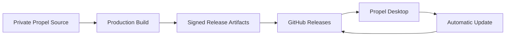

<div align="center">

# PROP​​EL

### Premium Windows System Care

A modern Windows optimization suite built to keep your system  
clean, responsive, and running at its best.

<br />

[](https://github.com/pranavop45/propel-releases/releases/latest)
[](https://github.com/pranavop45/propel-releases/releases)
[](https://github.com/pranavop45/propel-releases/releases)
[](https://github.com/pranavop45/propel-releases)

<br />

**[Download Propel](https://github.com/pranavop45/propel-releases/releases/latest)**

</div>

---

## ✦ About Propel

**Propel** is a premium Windows system-care application designed around
performance, maintenance, privacy, and intelligent system management.

It combines essential PC maintenance tools into one focused desktop
experience — without overwhelming the user with unnecessary complexity.

> **Clean system. Better performance. One place.**

---

## ◈ What Propel Does

<table>
<tr>
<td width="50%">

### ⚡ Performance

- Real-time CPU monitoring
- Memory monitoring
- Disk activity monitoring
- Live resource insights
- Performance-focused system tools

</td>
<td width="50%">

### 🧹 System Care

- Advanced junk-file scanning
- Safe cleanup workflows
- Browser cache cleanup
- System health checks
- Smart maintenance

</td>
</tr>

<tr>
<td width="50%">

### 🛡 Privacy & Intelligence

- Permission management
- Privacy-focused controls
- AI-powered features
- Intelligent system insights

</td>
<td width="50%">

### 🔄 Updates

- Background update checks
- Download progress
- SHA-512 verification
- ASAR integrity verification
- Seamless installer upgrades

</td>
</tr>
</table>

---

## ✦ Product Experience

Propel is designed around a simple principle:

**Powerful underneath. Simple on the surface.**

The interface focuses on:

- Clean visual hierarchy
- Fast interactions
- Minimal distractions
- Real-time system information
- Clear action states
- Lightweight animations
- Consistent Windows-native behavior

---

## ◇ Release Architecture

Propel keeps its application source separate from its public distribution
repository.



This repository contains **public release artifacts only**.

The application source code is maintained separately.

---

## ✦ Release Contents

Every production release may contain:

| Artifact | Purpose |
|---|---|
| `Propel-Setup-x.x.x.exe` | Windows installer |
| `Propel-Setup-x.x.x.exe.blockmap` | Differential update data |
| `latest.yml` | Update metadata used by the updater |

GitHub may also display its automatically generated source archives
alongside the release assets.

---

## 🚀 Latest Release

### Propel 1.3.0

**Current stable release**

- Windows installer
- Automatic update support
- SHA-512 release verification
- Propel ASAR integrity verification
- Production update channel
- Per-user Windows installation

### Download

**[→ Download Propel 1.3.0](https://github.com/pranavop45/propel-releases/releases/tag/v1.3.0)**

**[→ View all releases](https://github.com/pranavop45/propel-releases/releases)**

---

## 🔄 Automatic Updates

Propel includes a production update pipeline designed around
`electron-updater` and GitHub Releases.

```text
New Release
     │
     ▼
GitHub Release
     │
     ▼
Propel checks for updates
     │
     ▼
Background download
     │
     ▼
SHA-512 verification
     │
     ▼
ASAR integrity verification
     │
     ▼
Update Ready
     │
     ▼
Restart & Update
```

Users don't need to manually download every new version once the
automatic update system detects a newer release.

---

## 🛡 Release Integrity

Propel treats update integrity as a first-class part of the release
pipeline.

Release validation includes:

- SHA-512 verification
- Blockmap validation
- Release metadata validation
- Packaged application integrity checks
- ASAR integrity verification

The goal is to ensure that the update being installed matches the
official release artifact.

---

## 🖥 Supported Platform

| Platform | Support |
|---|:---:|
| Windows 10 | ✓ |
| Windows 11 | ✓ |
| macOS | — |
| Linux | — |

Propel is currently distributed as a Windows desktop application.

---

## 📦 Installation

### 1. Download

Open the latest release:

**https://github.com/pranavop45/propel-releases/releases/latest**

### 2. Run the installer

Download:

```text
Propel-Setup-x.x.x.exe
```

### 3. Install Propel

Follow the Windows installer and launch Propel.

---

## ✦ Release Philosophy

Propel releases are built around three principles:

<table>
<tr>
<td align="center" width="33%">

### 01

**Stable**

Production builds are tested before publication.

</td>
<td align="center" width="33%">

### 02

**Verifiable**

Release artifacts are validated before installation.

</td>
<td align="center" width="33%">

### 03

**Seamless**

Updates should feel like part of the product.

</td>
</tr>
</table>

---

## 🧩 Technology

Propel is built as a modern Windows desktop application with a
web-powered UI and native system capabilities.

**Core technologies include:**

- Electron
- TypeScript
- React
- Node.js
- Rust
- electron-builder
- electron-updater
- GitHub Releases

---

## 📁 Repository Structure

This repository intentionally stays lightweight.

```text
propel-releases/
│
├── README.md
│
└── GitHub Releases
    ├── Propel-Setup-x.x.x.exe
    ├── Propel-Setup-x.x.x.exe.blockmap
    └── latest.yml
```

No application source code is stored in this public distribution
repository.

---

## 🔐 Security

Never publish credentials, API keys, signing credentials, or personal
access tokens as release assets.

Release publishing credentials are kept outside the distributed
application.

If you discover a security issue, please report it privately rather than
publishing sensitive details publicly.

---

## ✦ Versioning

Propel follows semantic application versioning.

```text
MAJOR.MINOR.PATCH
```

Example:

```text
1.3.0
```

GitHub release tags use the corresponding `v` prefix:

```text
v1.3.0
```

---

## 📜 License

The Propel application source code is maintained separately from this
public release repository.

This repository exists for **official Propel distribution and release
artifacts**.

---

<div align="center">

### PROP​​EL

**System care, without the clutter.**

<br />

[Download Latest Release](https://github.com/pranavop45/propel-releases/releases/latest)
&nbsp;&nbsp;·&nbsp;&nbsp;
[View Releases](https://github.com/pranavop45/propel-releases/releases)

<br /><br />

<sub>© 2026 Propel. All rights reserved.</sub>

</div>
